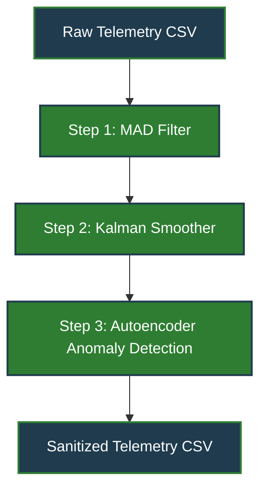

## Architecture Overview

The diagram illustrates the sequential processing pipeline:
1. **MAD Filter** removes point spikes.
2. **Kalman Smoother** reduces noise and imputes missing values.
3. **Autoencoder** detects contextual anomalies.
4. Output is a clean telemetry CSV ready for downstream analysis.
